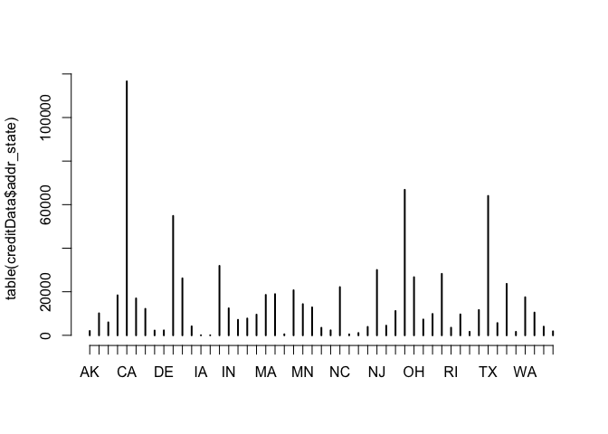
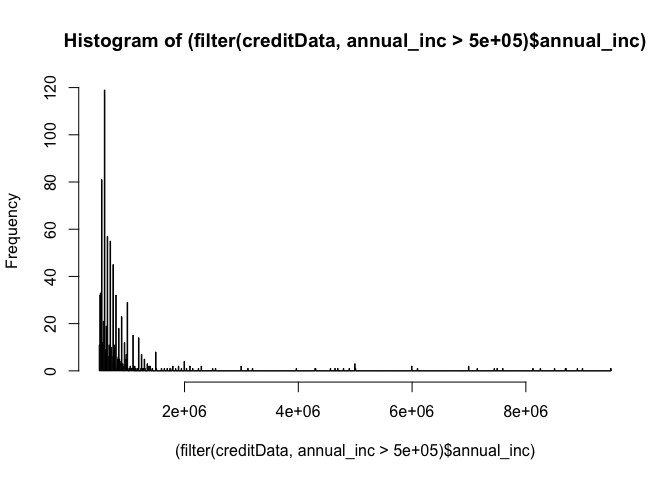

Assignment 1
================
David Krütli, Serhat Nergiz, Ibrahim Yaman, Mohamed Ramadan<br>
2023-11-12 20:31:46.339443

- [Business Understanding](#business-understanding)
- [Setup](#setup)
  - [Load Required Packages](#load-required-packages)
  - [Load Data](#load-data)
- [Explore Data](#explore-data)
  - [Attribute addr_state](#attribute-addr_state)
  - [Attribute annual_inc](#attribute-annual_inc)
  - […](#section)

# Business Understanding

Text **to follow** here.

# Setup

## Load Required Packages

First of all we are going to load the packages required for this
project.

``` r
#install.packages("readr")
#install.packages("tidyverse")
#install.packages("formattable")
library(readr)
library(tidyverse)
library(formattable)
```

## Load Data

Next we are going to load the data from the CSV file “LCdata.csv” and
display the first row to get a rough idea about the data.

``` r
creditData <- read_delim("/Users/serhat/Downloads/LCdata.csv", delim = ";", escape_double = FALSE, trim_ws = TRUE)
knitr::kable(head(creditData, 1))
```

|    id | member_id | loan_amnt | funded_amnt | funded_amnt_inv | term      | int_rate | installment | emp_title            | emp_length | home_ownership | annual_inc | verification_status | issue_d  | loan_status                                         | pymnt_plan | url                                                                  | desc                                                                                       | purpose | title                   | zip_code | addr_state |  dti | delinq_2yrs | earliest_cr_line | inq_last_6mths | mths_since_last_delinq | mths_since_last_record | open_acc | pub_rec | revol_bal | revol_util | total_acc | initial_list_status | out_prncp | out_prncp_inv | total_pymnt | total_pymnt_inv | total_rec_prncp | total_rec_int | total_rec_late_fee | recoveries | collection_recovery_fee | last_pymnt_d | last_pymnt_amnt | next_pymnt_d | last_credit_pull_d | collections_12_mths_ex_med | mths_since_last_major_derog | policy_code | application_type | annual_inc_joint | dti_joint | verification_status_joint | acc_now_delinq | tot_coll_amt | tot_cur_bal | open_acc_6m | open_il_6m | open_il_12m | open_il_24m | mths_since_rcnt_il | total_bal_il | il_util | open_rv_12m | open_rv_24m | max_bal_bc | all_util | total_rev_hi_lim | inq_fi | total_cu_tl | inq_last_12m |
|------:|----------:|----------:|------------:|----------------:|:----------|---------:|------------:|:---------------------|:-----------|:---------------|-----------:|:--------------------|:---------|:----------------------------------------------------|:-----------|:---------------------------------------------------------------------|:-------------------------------------------------------------------------------------------|:--------|:------------------------|:---------|:-----------|-----:|------------:|:-----------------|---------------:|-----------------------:|-----------------------:|---------:|--------:|----------:|-----------:|----------:|:--------------------|----------:|--------------:|------------:|----------------:|----------------:|--------------:|-------------------:|-----------:|------------------------:|:-------------|----------------:|:-------------|:-------------------|---------------------------:|----------------------------:|------------:|:-----------------|-----------------:|----------:|:--------------------------|---------------:|-------------:|------------:|------------:|-----------:|------------:|------------:|-------------------:|-------------:|--------:|------------:|------------:|-----------:|---------:|-----------------:|-------:|------------:|-------------:|
| 83489 |     83471 |      2600 |        2600 |             575 | 36 months |     8.38 |       81.94 | College Pro Painters | 3 years    | MORTGAGE       |       6500 | Not Verified        | Jun-2007 | Does not meet the credit policy. Status:Charged Off | n          | <https://www.lendingclub.com/browse/loanDetail.action?loan_id=83489> | I would like to refinance my credit card debt to recieve a better rate on the money I owe. | other   | Credit card refinancing | 806xx    | CO         | 6.46 |          NA | NA               |             NA |                     NA |                     NA |       NA |      NA |         0 |         NA |        NA | f                   |         0 |             0 |     2342.01 |          517.27 |         1962.69 |        329.05 |              21.64 |      28.63 |                    0.34 | Mar-2010     |           21.75 | Mar-2010     | Mar-2010           |                         NA |                          NA |           1 | INDIVIDUAL       |               NA |        NA | NA                        |             NA |           NA |          NA |          NA |         NA |          NA |          NA |                 NA |           NA |      NA |          NA |          NA |         NA |       NA |               NA |     NA |          NA |           NA |

# Explore Data

## Attribute addr_state

Display a summary of the attribute **addr_state**:

``` r
summary(creditData$addr_state)
```

    ##    Length     Class      Mode 
    ##    798641 character character

Plot the distribution of the attribute **addr_state**:

``` r
plot(table(creditData$addr_state))
```

<!-- -->

Build a contingency table of the counts at each combination of factor
levels.

``` r
table(creditData$addr_state)
```

    ## 
    ##     AK     AL     AR     AZ     CA     CO     CT     DC     DE     FL     GA 
    ##   1992  10101   5955  18362 116619  16940  12155   2194   2268  54824  26154 
    ##     HI     IA     ID     IL     IN     KS     KY     LA     MA     MD     ME 
    ##   4113     14     11  31885  12393   7110   7727   9500  18552  18908    469 
    ##     MI     MN     MO     MS     MT     NC     ND     NE     NH     NJ     NM 
    ##  20681  14310  12823   3457   2288  22138    431   1064   3865  30001   4429 
    ##     NV     NY     OH     OK     OR     PA     RI     SC     SD     TN     TX 
    ##  11158  66812  26687   7266   9809  28224   3500   9610   1616  11618  64003 
    ##     UT     VA     VT     WA     WI     WV     WY 
    ##   5631  23624   1607  17477  10447   3978   1841

**Conclusion**:

We should keep this attribute in the dataset for the moment. The
interest rate could depend on the area where the borrower lives. This
attribute needs to be converted into a categorical value (factor).

## Attribute annual_inc

Display a summary of the attribute **annual_inc**:

``` r
summary(creditData$annual_inc)
```

    ##    Min. 1st Qu.  Median    Mean 3rd Qu.    Max.    NA's 
    ##       0   45000   65000   75014   90000 9500000       4

Plot a historgram for **annual_inc**, where the annual income is higher
than 500’000:

``` r
hist((filter(creditData, annual_inc > 500000)$annual_inc), breaks = 1000)
```

<!-- -->

As can be seen in the histogram, there are a few very high values, so we
want to see if these are errors in our dataset. Therefore we are going
to list the **emp_title** and **verification_status** for the top 50
values.

``` r
select(head(creditData[order(creditData$annual_inc, decreasing = TRUE), ], 50), annual_inc, emp_title, verification_status)
```

    ## # A tibble: 50 × 3
    ##    annual_inc emp_title                           verification_status
    ##         <dbl> <chr>                               <chr>              
    ##  1    9500000 reg nurse                           Source Verified    
    ##  2    9000000 registered nurse                    Source Verified    
    ##  3    8900060 commercial driver                   Source Verified    
    ##  4    8706582 Correctional Sgt.                   Source Verified    
    ##  5    8700000 Customer Representative             Source Verified    
    ##  6    8500021 Senior Field Operator               Source Verified    
    ##  7    8253000 Sr Mgr                              Source Verified    
    ##  8    8121180 Facilities Operations Manager       Source Verified    
    ##  9    7600000 Interim Director of Case Management Source Verified    
    ## 10    7500000 Sales & service rep                 Verified           
    ## # ℹ 40 more rows

Looks like there are indeed some unrealistic values in our dataset: A
nurse with an annual income of USD 9.5 million or a commercial driver
with USD 8.9 million seems to be way above the expected income, although
source was verified.

**Conclusion**:

We should keep this attribute in the dataset for the moment. The
interest rate would probably depend on the borrower’s annual income, as
this tells us something about the borrower’s creditworthiness. The 4
records with NA for the annual income should be removed. We should also
consider filling the values above a certain threshold (e.g. 800’000)
with the median (i.e., 65’000).

## …
